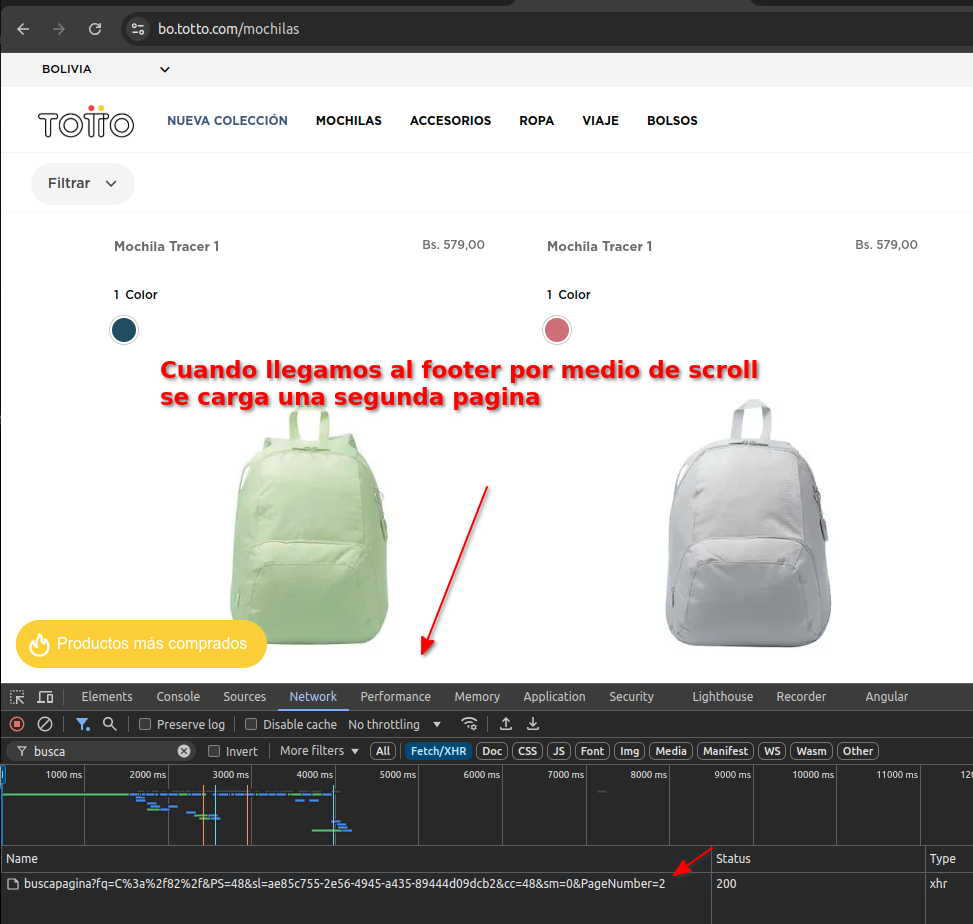

Scrapy de sitios con R

```{r librerias}
rm(list = ls())      # Para limpiar memoria
# Cargar librerías necesarias para reatlizar solicitudes HTTP, parseo de HTML, manipulación de datos y manejo de texto
library(httr)      # Para realizar solicitudes HTTP
library(rvest)     # Para extraer y parsear contenido HTML
library(dplyr)     # Para manipulación de datos
library(jsonlite)  # Para manejar datos JSON
library(stringr)   # Para trabajar con cadenas de texto
```

# Configuración General

```{r configuracion_general}
# Definimos el número de páginas a scrapear
num_paginas <- 5

# Definimos el agente de usuario para simular una solicitud desde un navegador
agente_usuario <- "Mozilla/5.0 (Windows NT 10.0; Win64; x64) AppleWebKit/537.36 (KHTML, like Gecko) Chrome/108.0.0.0 Safari/537.36"

# Función para configurar el agente de usuario en las solicitudes HTTP
configurar_agente_usuario <- function() {
  httr::set_config(httr::user_agent(agente_usuario))
}
```

# Funciones Generales

```{r funciones_generales}
# Función para crear una lista de URLs a scrapear
# Recibe como entrada una URL base, el número de páginas y una función opcional para parámetros adicionales
crear_lista_paginas <- function(url_base, num_paginas, funcion_parametros = NULL) {
  lista_urls <- vector("list", num_paginas)

  # Iteramos sobre el número de páginas para generar cada URL
  for (i in seq_len(num_paginas)) {
    lista_urls[[i]] <- if (is.null(funcion_parametros)) {
      # Si no se pasa una función para parámetros, concatenamos el número de página a la URL base
      paste0(url_base, i)
    } else {
      # Si se pasa una función, la usamos para generar los parámetros personalizados
      funcion_parametros(url_base, i)
    }
  }

  return(lista_urls)
}

# Función para convertir un texto en un slug amigable para URLs (sin caracteres especiales)
crear_slug <- function(texto) {
  texto %>%
    tolower() %>%                                 # Convertimos el texto a minúsculas
    str_replace_all("[^a-z0-9]+", "-") %>%        # Reemplazamos caracteres no alfanuméricos por guiones
    str_replace_all("(^-|-$)", "")                # Eliminamos guiones al inicio o final
}
```

# Scraping: Tienda "TOTTO"

scrapy HTML DOM, despues de ver el DOM podemos ver que hay un ajax que trae el html completo de cada pagina y tambien un json dentro del mismo html


```{r tienda_totto}
# Función para extraer datos de una página de productos de la tienda TOTTO
extraer_datos_totto <- function(url) {
  # Intentamos leer el contenido HTML de la página
  documento <- tryCatch(
    read_html(url, user_agent = agente_usuario),
    error = function(e) {
      message(paste("Error al cargar:", url))  # Mostramos un mensaje en caso de error
      return(NULL)                             # Retornamos NULL si hay un error
    }
  )

  if (is.null(documento)) return(NULL)         # Si no se pudo cargar el documento, salimos de la función

  print(paste("Extrayendo datos de:", url))

  # Seleccionamos los elementos HTML que contienen los productos
  productos_html <- documento %>% html_elements("div._banner-title")

  # Extraemos y retornamos la información relevante de cada producto
  data.frame(
    url = productos_html %>% html_element("a") %>% html_attr("href"),
    imagen = productos_html %>% html_element("img") %>% html_attr("src"),
    nombre = productos_html %>% html_element("h3 span") %>% html_text(trim = TRUE),
    precio = productos_html %>%
      html_element("span.__item-price") %>%
      html_text(trim = TRUE) %>%
      str_replace_all("Bs. ", "") %>% # quitamos signo "Bs. "
      str_replace_all("\\.", "") %>% # removemos todos los puntos por casos 1.153,00
      str_replace_all(",", ".") %>%  # convertimos comas en puntos
      as.numeric()
    ,
    stringsAsFactors = FALSE
  )
}

# Función para extraer datos de múltiples páginas de la tienda TOTTO
extraer_datos_sitio_totto <- function(url_base, num_paginas) {
  configurar_agente_usuario() # Configuramos el agente de usuario
  lista_urls <- crear_lista_paginas(url_base, num_paginas)  # Creamos la lista de URLs

  # Extraemos los datos de cada página y los combinamos en un solo data frame
  do.call(
    bind_rows,
    lapply(lista_urls, extraer_datos_totto)
  )
}
```

# Scraping: Noticias Nacional

## Scraping: Noticias "El Deber"

Scrapy JSON by urlParams - Despues de revisar el sitio del deber se puede e irnos a una categoria, podemos ver que el ver mas noticias carga un ajax con un JSON con el cual construye la visualizacion, probrando con los parametros y quitando el slug que corresponde a categoria podemos traer todas las noticias, por paginas que especifiquemos.

```{r noticias_deber}
# Función para extraer datos de una página de noticias de El Deber
extraer_datos_deber <- function(url) {
  # Intentamos realizar una solicitud GET a la URL
  respuesta <- tryCatch(
    GET(url, user_agent = agente_usuario),
    error = function(e) {
      message(paste("Error al cargar:", url))  # Mostramos un mensaje en caso de error
      return(NULL)                             # Retornamos NULL si hay un error
    }
  )

  if (is.null(respuesta)) return(NULL)         # Si no hay respuesta, salimos de la función

  print(paste("Extrayendo datos de:", url))
  # Parseamos el contenido JSON de la respuesta
  content <- content(respuesta, "text")
  datos_json <- fromJSON(content)

  # Extraemos y retornamos la información relevante de cada noticia
  data.frame(
    fecha = datos_json$PublicationDate,
    titular = datos_json$Title_en,
    medio = "El Deber",
    url = paste0(
      "https://eldeber.com.bo/",
      crear_slug(datos_json$Nodes_en[1]),
      "/",
      datos_json$Url,
      "_",
      datos_json$Id
    ),
    stringsAsFactors = FALSE
  )
}

# Función para extraer datos de múltiples páginas de noticias de El Deber
extraer_datos_sitio_deber <- function(url_base, num_paginas) {
  configurar_agente_usuario()                   # Configuramos el agente de usuario

  # Creamos la lista de URLs con parámetros personalizados
  lista_urls <- crear_lista_paginas(url_base, num_paginas, function(base, i) {
    desde <- (i - 1) * 50
    hasta <- i * 50
    paste0(base, "?from=", desde, "&to=", hasta)
  })

  # Extraemos los datos de cada página y los combinamos en un solo data frame
  do.call(
    bind_rows,
    lapply(lista_urls, extraer_datos_deber)
  )
}
```

## Scraping: Noticias "La Prensa"

scrapy HTML DOM, Analizando el codigo vemos que la pagina esta desarrollada en Drupal y que ingresando a una página de categoria, si presionamos en paginador este actualiza por ajax la pagina, pero es complicado replicar el ajax por la session. Entonces se puede abrir la pagina en una nueva pestaña con los parametros `?q=views/ajax&page=2` los cuales podemos reutilizar

```{r noticias_prensa}
# Función para extraer datos de una página de noticias de La Prensa
extraer_datos_prensa <- function(url) {
  # Intentamos leer el contenido HTML de la página
  documento <- tryCatch(
    read_html(url, user_agent = agente_usuario),
    error = function(e) {
      message(paste("Error al cargar:", url))  # Mostramos un mensaje en caso de error
      return(NULL)                             # Retornamos NULL si hay un error
    }
  )

  if (is.null(documento)) return(NULL)         # Si no se pudo cargar el documento, salimos de la función

  print(paste("Extrayendo datos de:", url))

  # Seleccionamos los elementos HTML que contienen las noticias
  noticias_html <- documento %>% html_elements("div.views-row")

  # Extraemos y retornamos la información relevante de cada noticia
  data.frame(
    fecha = noticias_html %>% html_element("time") %>% html_attr("datetime"),
    titular = noticias_html %>% html_element("h2 a") %>% html_text(trim = TRUE),
    url = paste0(
      "https://laprensa.bo",
      noticias_html %>% html_element("h2 a") %>% html_attr("href")
    ),
    medio = "La Prensa",
    stringsAsFactors = FALSE
  )
}

# Función para extraer datos de múltiples páginas de noticias de La Prensa
extraer_datos_sitio_prensa <- function(url_base, num_paginas) {
  configurar_agente_usuario()                   # Configuramos el agente de usuario
  lista_urls <- crear_lista_paginas(url_base, num_paginas)  # Creamos la lista de URLs

  # Extraemos los datos de cada página y los combinamos en un solo data frame
  do.call(
    bind_rows,
    lapply(lista_urls, extraer_datos_prensa)
  )
}
```

# Ejecución y Guardado

Podemos ejecutar los scrapers desde aqui

```{r ejecucion_y_guardado}
# Definimos las URLs base de cada fuente
url_base_totto <- "https://bo.totto.com/buscapagina?fq=C%3a%2f82%2f&PS=48&sl=ae85c755-2e56-4945-a435-89444d09dcb2&cc=48&sm=0&PageNumber="
url_base_deber <- "https://eldeber.com.bo/api/news/getMore"
url_base_prensa <- "https://laprensa.bo/politica?q=views/ajax&page="

# Extraemos los datos de cada sitio
datos_productos <- extraer_datos_sitio_totto(url_base_totto, num_paginas)

datos_noticias_deber <- extraer_datos_sitio_deber(url_base_deber, num_paginas)
datos_noticias_prensa <- extraer_datos_sitio_prensa(url_base_prensa, num_paginas)

# Combinamos las noticias de las distintas fuentes en un solo data frame
datos_noticias <- bind_rows(datos_noticias_deber, datos_noticias_prensa)

# Guardamos los datos extraídos en un archivo
save(datos_productos, datos_noticias, file = "_data/datos_scrapeados.RData")

```
# Visualización de datos
```{r estadisticas}
# Mostrar las tablas generadas
str(datos_productos)
head(datos_productos)

str(datos_noticias)
head(datos_noticias)
```

